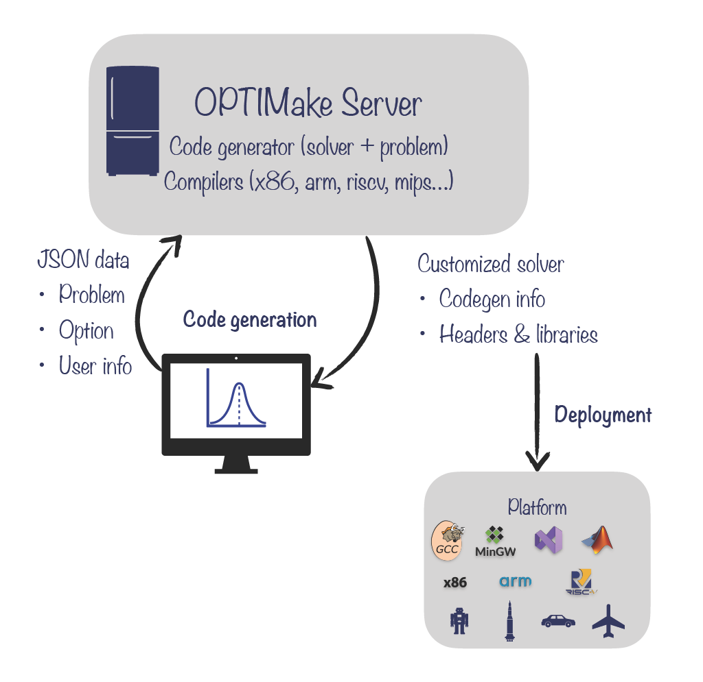

# **代码生成与部署**

当完成问题定义后，需通过OPTIMake提供的代码生成接口生成代码。
该章节主要介绍了如何配置代码生成以及调用生成的代码或库。

<figure markdown="span">
  
  <figcaption>代码生成与部署流程</figcaption>
</figure>

!!! Note

    代码生成需要将problem，option与user info通过json格式上传至OPTIMake服务器。该过程需要联网，所有上传的json数据均对用户透明（所有的客户端代码均开源且包含在安装包中）。
    代码生成服务亦可用户本地部署（需要production license），请联系OPTIMake获取支持。

## **代码生成**
下面为代码生成的例子：

=== "Python"
    ``` python
    option = codegen_option()
    option.solver = 'pdipm' # primal-dual interior-point method
    option.server = 'http://xxxxxxxxx' # OPTIMake server address
    option.enable_printing = True
    option.optimization_level = 3
    # 'windows-x86_64-mingw', 'linux-x86_64-gcc', 'linux-arm64-gcc', 'linux-armv7-gcc'
    option.platform = 'linux-x86_64-gcc'

    codegen = code_generator()
    codegen.codegen(prob, option)
    ```

假设问题的名称为 'vehicle'，生成platform为 'linux-x86_64-gcc'，OPTIMake会生成以下文件：

- libvehicle_solver_shared.so：生成代码的动态链接库（platform为windows时后缀为.dll）
- libvehicle_solver_static.a：生成代码的静态链接库（platform为windows时后缀为.dll.a）
- vehicle_solver.h：生成代码的接口头文件
- option.json：代码生成option对应的json文件
- problem.json：问题对应的json文件

!!! Note

    每一次代码生成都会有唯一的session uuid。当前代码生成失败时，请提供该id以及返回状态至OPTIMake以获取技术支持。

## **代码部署**

包含生成的接口头文件以及链接动态库或静态库即可调用生成代码。调用生成代码时需注意：

- 调用平台及编译器需与代码生成中的option.platform保持一致
- 当调用的平台为Linux/Mac时，需要链接math库（-lm），以使用sin，cos，tan，sqrt等函数。
- 当调用平台为Windows时，需要iphlpapi链接（-liphlpapi），以获取mac地址。

