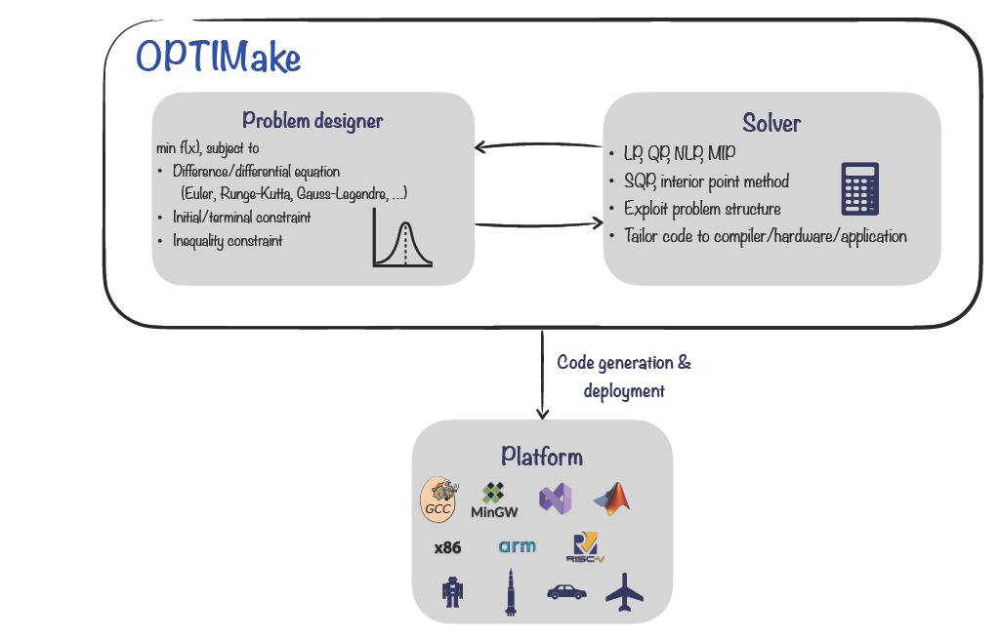

# **OPTIMake: Build Your Ultrafast Solver**

## **简介**

OPTIMake是一款针对飞行器、机器人、无人驾驶等领域中广泛存在的估计、决策、规划与控制等优化问题的专用建模与求解软件。通过将求解算法与问题深入结合并针对所部署的硬件优化，OPTIMake提供业界领先的建模与实时求解能力。

OPTIMake包含建模，求解以及代码生成功能。建模功能通过符号化与参数化建模方式，使得用户能方便简洁地定义优化问题。
求解功能包含多种求解算法与支持多种类型问题求解，提供高效稳定的实时求解。
代码生成功能通过问题的特殊结构，生成为问题与硬件定制且不依赖三方库的高效稳定的求解代码。

<figure markdown="span">
  
  <figcaption>Overview of OPTIMake</figcaption>
</figure>

该手册提供了OPTIMake的安装、支持的问题与建模、代码生成与部署、求解接口等方面的详细说明。

<!-- 众所周知，基于实时在线优化的控制与决策，已经成为智能机器实现复杂动态行为的基本计算途径。
尤其以用于非线性最优控制的实时嵌入式求解器技术显示出根本的重要性。

OPTIMake是一套专注于开发机器人飞行器以及无人驾驶等领域中的下一代模型预测控制(MPC)系统基础性工具。
我们的专业知识涵盖先进的多变量控制设计、最先进的优化算法以及高效稳健的软件实现。

{ align=left width=300 }
 
OPTIMake可以帮助汽车工程师开发基于嵌入式MPC和机器学习的先进控制系统。我们在ADAS、自动驾驶、运动控制、动力总成控制、车辆动力学、代客泊车、等方面拥有丰富的经验。
 
 
 

{ align=right width=300 }
 
 
我们致力于为航天工业的制导、导航和控制设计先进的实时计算提供算法和软件支持。应用包括卫星姿态控制、空间交会和无人机自主导航。
 
 
 -->

## **License**

OPTIMake的license根据优化问题类型与部署平台进行区分。

| 优化问题类型      | 描述                          |
| ----------- | ------------------------------------ |
| `s`       |  支持LP, QP, QCQP类型问题求解  |
| `l`       |  支持LP, QP, QCQP, NLP, MIP类型问题求解 |

| 部署平台      | 描述                          |
| ----------- | ------------------------------------ |
| `host`       |  Host环境（Windows/Linux），求解器可在x86/x86_64平台运行，通过二进制库集成|
| `test`       |  测试环境，求解器可在x86/x86_64/ARMv8/ARMv7等多种平台运行，通过二进制库集成 |
| `commercial` |  生产环境，求解器可在x86/x86_64/ARMv8/ARMv7等多种平台运行，通过源代码集成 |
 
例：如果问题类型为NLP且需要在ARM环境进行测试，那么对应的license为`s-test`。

<!-- E-mail支持

如果出现技术问题，请联系OPTIMake支持：optimake@outlook.com。为了加快这一过程，我们建议您提供以下信息：

+ 您使用的正是OPTIMake版本。

+ 您正在使用的平台（Linux、Windows、MacOS、32位或64位）。

+ 您正在使用的API（C、MATLAB、Python、R）。

+ 日志信息和错误消息。

+ 再现问题所需的数据，例如任务文件或代码示例（如果相关）。

+ 有关常见问题、安装问题和转储任务文件的说明，请参阅我们的常见问题解答。 -->

<!-- ## **Release Notes** -->
